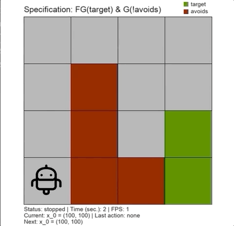

# pFaces-OmegaThreads

Automatic design of correct-by-construction software is a becoming a popular approach to design controllers for safety-critical systems.
This eliminates the need for post-testing/post-verification steps.
Design requirements are usually given in a formal language (e.g., [linear temporal logic (LTL)](https://en.wikipedia.org/wiki/Linear_temporal_logic) formulae) and safety-critical systems are described by models such as differential or difference equations.

**OmegaThreads** is a tool for parallel automated controller synthesis for dynamical systems to satisfy [ω-regular](https://en.wikipedia.org/wiki/Omega-regular_language) specifications given as LTL formulae.

<p align="center"> 
    
    <br />
    Fig. 1: The Python-Arcade-based 2d-simulator prrovided by OmegaThreads. <br />
    This simulation is recorded from the <a href="/examples/vehicle3d/">Autonomous Vehicle Example</a>. <br />
    The vehicle is supposed to infinitely-often visit the two targets (target1) and (target2) while not crashing in (avoids).
    
</p>

In a brief, **OmegaThreads** uses [OWL library](https://owl.model.in.tum.de) to construct a deterministic [ω-Automaton](https://en.wikipedia.org/wiki/Ω-automaton) with a parity acceptance condition representing the input LTL specifications.
The given model (e.g., a system of differential equations) of the dynamical system is used to construct a [symbolic model](https://www.hyconsys.com/research.html) that abstracts the model.
**OmegaThreads** then builds a [parity game](https://en.wikipedia.org/wiki/Parity_game) (the model is a player and the controller is a player) using the symbolic model and the specification's Automaton.
Finally, **OmegaThreads** solving the game playing at the controller side using a strategy iteration method.
Winning the game results in a closed-loop controller that is guaranteed to enforce the given specification on the dynamical system.
**OmegaThreads** generates the synthesized controller as a [Mealy machine](https://en.wikipedia.org/wiki/Mealy_machine).


In **OmegaThreads**, scalable parallel algorithms are designed to construct symbolic model, construct the parity game and to synthesize the controllers. They are implemented on top of [pFaces](https://www.parallall.com/pfaces) as a kernel that supports parallel execution within CPUs, GPUs and hardware accelerators (HWAs).

## **Installation using Docker**
Here, we assume you will be using a Linux or MacOS machine. Commands will be slightly different on Windows if you use Windows PowerShell.
We tested this on Linux, on MacOs and on Windows using WSL.

First, make sure to configure Docker to use all of the resources available (e.g., all CPU cores). Otherwise, OmegaThreads will run slower than expected. Also, in case you are using a GPU, make sure to pass-through the GPU in Docker. See this [guide](https://docs.docker.com/config/containers/resource_constraints/).

Download the Dockerfile:
``` bash
$ mkdir OmegaThreads
$ cd OmegaThreads
$ curl https://raw.githubusercontent.com/mkhaled87/pFaces-OmegaThreads/master/Dockerfile -o Dockerfile
```    

Build the Docker image:
``` bash
$ docker build -t omega/latest .
```    
The Docker image building process will take arrpximatly 15 minutes. 
During the build, you may recieve some red-colored messages.
They are not errors, unless you receieve an excplicit red-colored error message.
Once done, run/enter the image's interactive shell
``` bash
$ docker run -it -v ~/docker_shared:/docker_shared omega/latest
```    
Note that by the previous command, we mad a pipe between host and the container (this part: *-v ~/docker_shared:/docker_shared*) which will later allow us to move files (e.g., the synthesized controller) from the container to the host.

Now OmegaThreads is installed and we will test it with a simmple example.
In case you need to know more about OmegaThreads, we advise you to read the **Getting Started** section below.
In the Docker image, OmegaThreas sis located in the director **pFaces-OmegaThreads** and you can navigate to it as follows:
``` bash
/# cd pFaces-OmegaThreads
```

In the Docker image, we installed Oclgrind to simulate an OpenCL platform/device that utilizes all the CPU cores using threads. Unless you will be passing-through your device (e.g., a GPU), you MUST preceed any pFaces command with oclgrind. For example, to check available devices using Oclgrind/pFaces, run:
``` bash
/# oclgrind pfaces -CG -l
```

Now you can test one of the examples of OmegaThreads. Navigate to, for example, the robot exammple and launch it using oclgrind:
``` bash
/# cd examples/robot2d
/# oclgrind pfaces -CG -d 1 -k omega@../../kernel-pack -cfg robot.cfg
```

In case you need to move the controller to the host for simulation,  copy it as follows to the shared folder (we copy the simulation scripts as well):
``` bash
/# cp robot.mdf /docker_shared/
/# cp robot.png /docker_shared/
/# cp simulate.py /docker_shared/
/# cp ../../interface/python/*.py /docker_shared/
```

Now, without closing the running docker container, start a new terminal on the host and simulate the controller (make sure Python 3.6+, Arcade and Parglare are installed before running this command and refer to Python's requirements below for more info):
``` bash
$ cd ~/docker_shared
$ python3 simulate.py
```    

## **Installation using Source Code**

### **Prerequisites**

#### pFaces

You first need to have have [pFaces](http://www.parallall.com/pfaces) installed and working. Test the installation of pFaces and make sure it recognizes the parallel hardware in your machine by running the following command:

``` bash
$ pfaces -CGH -l
```

where **pfaces** calls pFaces launcher as installed in your machine. This should list all available HW configurations attached to your machine and means you are ready to work with OmegaThreads.

#### OWL Library

OWL library is used to construct a parity Automaton from the input LTL specifications. if you are using Linux or MacOs, we automated the installation of OWL using the a script. Run the following command to install OWL and its requirements (mainly a JDK supporting Java 11 and GraalVM):

``` bash
$ sh kernel-driver/lib/ltl2dpa/install-owl.sh
```

If you are using Windows, you will have to manually install OWL. Please refer to the installation [guide of OWL](https://gitlab.lrz.de/i7/owl/blob/master/README.md) for help. Once built and generated a static library (a .lib a), use it in the link settings in Visual Studio. You will also need to point to the include directories of OWL in the include settings of Visual Studio. Once we test **OmegaThreads** on Windows, we will update this section with details on the installation of OWL or we will create an installation BATCH for it.

#### Python

If you like to access the generated controller file using Python or simulate the closed-loop behavior using the provided 2d simulator, you need to have Python 3.6+ installed and both arcade and parglare packages. To install the required packages, run:

``` bash
$ pip3 install arcade
$ pip3 install parglare
```

#### Build Tools before Building pFaces-OmegaThreads

OmegaThreads is given as source code that need to be built before running it. This requires a modern C/C++ compiler such as:

- For windows: Microsoft Visual C++ (OmegaThreads is tested with Visual Studio 2019 community edition);
- For Linux/MacOS: GCC/G++.

### **Building OmegaThreads**

#### Windows

If you will be using Visual Studio on Windows, download the repository and open the provided VisualStudio-solution file [pFaces-OmegaThreads.sln](pFaces-OmegaThreads.sln) and build it using the **Release (x64)** configuration. Building with **Debug** configuration will result in a slower operation and requires having the debug binaries of pFaces.

#### Linux or MacOS

If you will be using Linux or MacOS, assuming you have a GIT client, simply run the following command to clone this repo:

``` bash
$ git clone --depth=1 https://github.com/mkhaled87/pFaces-OmegaThreads
```

OmegaThreads requires to link with pFaces SDK. The environment variable **PFACES_SDK_ROOT** should point to pFaces SDK root directory. Make sure you have the environment variable **PFACES_SDK_ROOT** pointing to the full absolute pFaces SDK folder. If not, do it as follows:

``` bash
$ export PFACES_SDK_ROOT=/full/path/to/pfaces-sdk
```

Now, navigate to the created repo folder and build OmegaThreads:

``` bash
$ cd pFaces-OmegaThreads
$ make
```

## **Getting Started**

Now, you have OmegaThreads installed and ready to be used. You might now run a given example or build your own.

### **File structure of OmegaThreads**

- [examples](/examples): the folder contains pre-designed examples.
- [interface](/interface): the folder contains the Python interface to access the files generated by OmegaThreads.
- [kernel-driver](/kernel-driver): the folder contains C++ source codes of OmegaThreads pFaces kernel driver.
- [kernel-pack](/kernel-pack): the folder contains the OpenCL codes of the OmegaThreads and will finally hold the binaries of the loadable kernel of OmegaThreads.

### **Running an example**

Navigate to any of the examples in the directory [/examples](/examples). Within each example, one or more .cfg files are provided. Config files tells OmegaThreads about the system under consideration and the requirements it should consider when designing a controller for the system.

Say you navigated to the example in [/examples/robot2d](/examples/robot2d) and you want to launch OmegaThreads with the config file [robot.cfg](/examples/robot2d/robot.cfg), then run the following command from any terminal located in the example folder:

``` bash
$ pfaces -CGH -d 1 -k omega@../../kernel-pack -cfg robot.cfg -p
```

where **pfaces** calls pFaces launcher, "-CGH -d 1" asks pFaces to run OmegaThreads in the first device of all available devices, "-k omega@../../kernel-pack" tells pFaces about OmegaThreads and where it is located, "-cfg robot.cfg" asks pFaces to hand the configuration file to OmegaThreads, and "-p" asks pFaces to collect profiling information. Make sure to replace each / with \ in case you are using Windows command line.

For this example, you may also directly use the script **solve.sh** instead of writing the complete pFaces command:

``` bash
$ sh solve.sh
```

Once the controller is synthesized, it is saved to an (.mdf) file. You can now use the provided Python interface and 2d simulator to simulate the closed loop:

``` bash
$ python3 simulate.py
```

This should start the 2d simulator and simulate the closed loop as follows:

<p align="center"> 
    
</p>

## **The configuration files**

Each configuration file corresponds to a case describing a system and the requirements to be used to synthesize a controller for it. Config files are plain-text files with scopes and contents (e.g., "scope_name { contents }"), where the contents is a list of ;-separated key="value" pairs. Note that values need to be enclosed with double quotes. For a better understanding of such syntax, take a quick look to this [example config file](/examples/robot2d/robot.cfg).

The following are all the keys that can be used in OmegaThreads config files:

- **project_name**: a to describe the name of the project (the case) and will be used as name for output files. If not provided, this key will be set to *"empty_project"*.

- **system.states.dimension**: declares the dimension (N) of the dynamical system.

- **system.states.first_symbol**: declares a vector of size N describing the fist symbol in the states set of the symbolic model.

- **system.states.last_symbol**: declares a vector of size N describing the last symbol in the states set of symbolic model.

- **system.states.quantizers**: declares a vector of size N describing the space between each two symbols in the state set of the symbolic model.

- **system.states.initial_state**: declares a the initial state of the system.

- **system.states.subsets.names**: declares a comma separated list of names for atomic propositions on the states set. A set with name (**ABC**) should be followed with a mapping declaration in **system.states.subsets.mapping_ABC** describing which state sets map to the atomic proposition **ABC**.

- **system.controls.dimension**: declares the dimension (P) of the controls of the dynamical system.

- **system.controls.first_symbol**: declares a vector of size P describing the fist symbol in the controls set of the symbolic model.

- **system.controls.last_symbol**: declares a vector of size P describing the last symbol in the controls set of symbolic model.

- **system.controls.quantizers**: declares a vector of size P describing the space between each two symbols in the controls set of the symbolic model.

- **system.controls.subsets.names**: declares a comma separated list of names for atomic propositions on the controls set. A set with name (**ABC**) should be followed with a mapping declaration in **system.controls.subsets.mapping_ABC** describing which control sets map to the atomic proposition **ABC**.

- **system.dynamics.code_file**: the relative-path/name of OpenCL file describing the dynamics of the system. The path should be relative to the config file. The OpenCL file should declare at least a function with the signature:

``` C
void model_post(concrete_t* post_x_lb, concrete_t* post_x_ub,  const concrete_t* x, const concrete_t* u);
```

- **specifications.ltl_formula**: the LTL formula describing the specifications to be enforced on the system. Only the atomic propositions declared in **system.states.subsets.names** and **system.controls.subsets.names** can be used.

- **specifications.write_dpa**: a "true" or "false" value that instructs OmegaThreads to write/not-write the constructed parity automaton.

- **implementation.implementation**: the type of controller implementation. This can currently only be "mealy_machine".

- **implementation.generate_controller**: a "true" or "false" value that instructs OmegaThreads to save the controller or not.


## **Authors**

- [**Mahmoud Khaled**](http://www.mahmoud-khaled.com).
- [**Majid Zamani**](http://www.hyconsys.com/members/mzamani).

## **License**

See the [LICENSE](LICENSE) file for details

## Known Issues

- Installing the strix-ltl2dpa library can sometimes generate an error "java.net.SocketException: Network is unreachable". Please use a different non-WLAN network. This used for example to happen when i use WLAN networks with IP6 (e.g., Eduroam in TUM).
