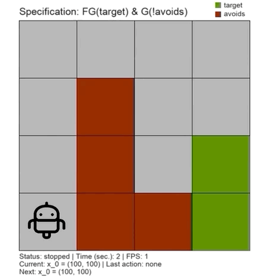

# pFaces-OmegaThreads

Automatic design of correct-by-construction software is a becoming a popular approach to design controllers for safety-critical systems.
This eliminates the need for post-testing/post-verification steps.
Design requirements are usually given in a formal language (e.g., [linear temporal logic (LTL)](https://en.wikipedia.org/wiki/Linear_temporal_logic) formulae) and safety-critical systems are described by models such as differential or difference equations.

**OmegaThreads** is a tool for parallel automated controller synthesis for dynamical systems to satisfy [ω-regular](https://en.wikipedia.org/wiki/Omega-regular_language) specifications given as LTL formulae.

<p align="center"> 
    
</p>

In a brief, **OmegaThreads** uses [OWL library](https://owl.model.in.tum.de) to construct an [ω-Automaton](https://en.wikipedia.org/wiki/Ω-automaton) with a parity acceptance condition representing the input LTL specifications.
The given model (e.g., a system of differential equations) of the dynamical system is used to construct a [symbolic model](https://www.hyconsys.com/research.html) that abstracts the model.
**OmegaThreads** then builds a [parity game](https://en.wikipedia.org/wiki/Parity_game) (the model is a player and the controller is a player) using the symbolic model and the specification's Automaton.
Finally, **OmegaThreads** solving the game playing at the controller side using a strategy iteration method.
Winning the game results in a closed-loop controller that is guaranteed to enforce the given specification on the dynamical system.
**OmegaThreads** generates the synthesized controller as a [Mealy machine](https://en.wikipedia.org/wiki/Mealy_machine).


In **OmegaThreads**, scalable parallel algorithms are designed to construct symbolic model, construct the parity game and to synthesize the controllers. They are implemented on top of [pFaces](https://www.parallall.com/pfaces) as a kernel that supports parallel execution within CPUs, GPUs and hardware accelerators (HWAs).

## **Installation using Docker**
Here, we assume you will be using a Linux or MacOS machine. Commands will be slightly different on Windows if you use Windows PowerShell.

First, make sure to configure Docker to use all of the resources available (e.g., all CPU cores). Otherwise, OmegaThreads will run slower than expected. Also, in case you are using a GPU, make sure to pass-through the GPU in Docker. See this [guide](https://docs.docker.com/config/containers/resource_constraints/).

Download the Dockerfile:
``` bash
$ mkdir OmegaThreads
$ cd OmegaThreads
$ wget https://raw.githubusercontent.com/mkhaled87/pFaces-OmegaThreads/master/Dockerfile
```    

Build the Docker image:
``` bash
$ docker build -t omega/latest .
```    

Run/enter the image's interactive shell
``` bash
$ docker run -it omega/latest
```    

Now you can use OmegaThreads. It is located in the director **OmegaThreads** and you can navigate to it as follows:
``` bash
$ cd OmegaThreads
```

In the Docker image, we installed Oclgrind to simulate an OpenCL platform/device that utilizes all the CPU cores using threads. Unless you will be passing-through your device (e.g., a GPU), you MUST preceed any pFaces command with oclgrind. For example, to check available devices using Oclgrind/pFaces, run:
``` bash
$ oclgrind pfaces -CGH -l
```

## **Installation using Source Code**

### **Prerequisites**

#### pFaces

You first need to have have [pFaces](http://www.parallall.com/pfaces) installed and working. Test the installation of pFaces and make sure it recognizes the parallel hardware in your machine by running the following command:

``` bash
$ pfaces -CGH -l
```

where **pfaces** calls pFaces launcher as installed in your machine. This should list all available HW configurations attached to your machine and means you are ready to work with OmegaThreads.

#### OWL Library

OWL library is used to construct a parity Automaton from the input LTL specifications. if you are using Linux or MacOs, we automated the installation of OWL using the a script. Run the following command to install OWL and its requirements (mainly a JDK supporting Java 11 and GraalVM):

``` bash
$ sh kernel-driver/lib/ltl2dpa/install-owl.sh
```

If you are using Windows, you will have to manually install OWL. Please refer to the installation [guide of OWL](https://gitlab.lrz.de/i7/owl/blob/master/README.md) for help. Once built and generated a static library (a .lib a), use it in the link settings in Visual Studio. You will also need to point to the include directories of OWL in the include settings of Visual Studio. Once we test **OmegaThreads** on Windows, we will update this section with details on the installation of OWL or we will create an installation BATCH for it.

#### Python

If you like to access the generated controller file using Python or simulate the closed-loop behavior using the provided 2d simulator, you need to have Python 3.5+ installed and both arcade and parglare packages. To install the required packages, run:

``` bash
$ pip3 install arcade
$ pip3 install parglare
```

#### Build Tools before Building pFaces-OmegaThreads

OmegaThreads is given as source code that need to be built before running it. This requires a modern C/C++ compiler such as:

- For windows: Microsoft Visual C++ (OmegaThreads is tested with Visual Studio 2019 community edition);
- For Linux/MacOS: GCC/G++.

### **Building OmegaThreads**

#### Windows

If you will be using Visual Studio on Windows, download the repository and open the provided VisualStudio-solution file [pFaces-OmegaThreads.sln](pFaces-OmegaThreads.sln) and build it using the **Release (x64)** configuration. Building with **Debug** configuration will result in a slower operation and requires having the debug binaries of pFaces.

#### Linux or MacOS

If you will be using Linux or MacOS, assuming you have a GIT client, simply run the following command to clone this repo:

``` bash
$ git clone --depth=1 https://github.com/mkhaled87/pFaces-OmegaThreads
```

OmegaThreads requires to link with pFaces SDK. The environment variable **PFACES_SDK_ROOT** should point to pFaces SDK root directory. Make sure you have the environment variable **PFACES_SDK_ROOT** pointing to the full absolute pFaces SDK folder. If not, do it as follows:

``` bash
$ export PFACES_SDK_ROOT=/full/path/to/pfaces-sdk
```

Now, navigate to the created repo folder and build OmegaThreads:

``` bash
$ cd pFaces-OmegaThreads
$ make
```

## **Getting Started**

Now, you have OmegaThreads installed and ready to be used. You might now run a given example or build your own.

### **File structure of OmegaThreads**

- [examples](/examples): the folder contains pre-designed examples.
- [interface](/interface): the folder contains the Python interface to access the files generated by OmegaThreads.
- [kernel-driver](/kernel-driver): the folder contains C++ source codes of OmegaThreads pFaces kernel driver.
- [kernel-pack](/kernel-pack): the folder contains the OpenCL codes of the OmegaThreads and will finally hold the binaries of the loadable kernel of OmegaThreads.

### **Running an example**

Navigate to any of the examples in the directory [/examples](/examples). Within each example, one or more .cfg files are provided. Config files tells OmegaThreads about the system under consideration and the requirements it should consider when designing a controller for the system.

Say you navigated to the example in [/examples/robot2d](/examples/robot2d) and you want to launch OmegaThreads with the config file [robot.cfg](/examples/robot2d/robot.cfg), then run the following command from any terminal located in the example folder:

``` bash
$ pfaces -CGH -d 1 -k omega@../../kernel-pack -cfg robot.cfg -p
```

where **pfaces** calls pFaces launcher, "-CGH -d 1" asks pFaces to run OmegaThreads in the first device of all available devices, "-k omega@../../kernel-pack" tells pFaces about OmegaThreads and where it is located, "-cfg robot.cfg" asks pFaces to hand the configuration file to OmegaThreads, and "-p" asks pFaces to collect profiling information. Make sure to replace each / with \ in case you are using Windows command line.

For this example, you may also directly use the script **solve.sh** instead of writing the complete pFaces command:

``` bash
$ sh solve.sh
```

Once the controller is synthesized, it is saved to an (.mdf) file. You can now use the provided Python interface and 2d simulator to simulate the closed loop:

``` bash
$ python3 simulate.py
```

This should start the 2d simulator and simulate the closed loop as follows:

<p align="center"> 
    
</p>

## **Designing your own example**

We recommend copying and modifying one of the provided examples to avoid syntactical mistakes. Examples are simply configuration files that asks OmegaThreads to achieve specific tasks. The next subsection will guide you understand the fields in OmegaThreads config files.

### **The configuration files**

Each configuration file corresponds to a case describing a stochastic system and the requirements to be used to synthesize a controller for it. Config files are plain-text files with scopes and contents (e.g., "scope_name { contents }"), where the contents is a list of ;-separated key="value" pairs. Note that values need to be enclosed with double quotes. For a better understanding of such syntax, take a quick look to this [example config file](/examples/ex_toy_safety/toy2d.cfg). 

The following are all the keys that can be used in OmegaThreads config files:


- **project_name**: a to describe the name of the project (the case) and will be used as name for output files. If not provided, this key will be set to *"empty_project"*.

- **data**: describes the used data model and should be currently set to "raw". If not provided, this key will be set to *"empty_project"*.

- **include_files**: This field is optional. It describes the a list of any additional OpenCL code files the users wish to include into the computation process. This allows users to, for example, include custom PDF functions or custom dynamics of the systems. This is what makes OmegaThreads extensible to the finest grain level.

- **save_transitions**: a "true" or "false" value that instructs OmegaThreads to construct and save the MDP (a.k.a., the Probabilities matrix) or ignore it and do the computation on the fly (OTF). When not provided, the default value is *"false"*.

- **save_controller**: a "true" or "false" value that instructs OmegaThreads to save the controller or not. When not provided, the default value is *"true"*.

- For the scopes **states** (required), **inputs** (required), or **disturbances** (optional), the following keys must be provided:
    - **dim**: an integer declaring the dimension.
    - **lb**: a comma-separated list giving the top-right corner vector.
    - **ub**: a comma-separated list giving the bottom-left corner vector.

- The scope **post_dynamics** is required and it describes the system. The following keys are used inside this scope:
    - **xx0** to **xx21** (required): the left-hand-side of each component of the difference equation of the system.
    - **constant_values** (optional): a single line OpenCL codes declaring constant values. The code line, or any internal lines, should end with ;.
    - **code_before** (optional) and **code_after** (optional): two lines of OpenCL codes that will preceed or succeed the dynamics **xx0** to **xx21**.

- The scope **noise** is required and it describes the noise. The following keys are used inside this scope:
    - **type**: this describes whether the noise is *"additive"* or *"multiplicative"*. When not specified, the default value is *"additive"*.
    - **pdf_truncation**: this describes how OmegaThreads can truncate the probability density function (PDF) in order to save the memory. This can be one of the following: *"no_truncation"* (the probabilities will be recorded for all state variables below the PDF surface), *"fixed_truncation"* (the probabilities will be recorded for a fixed region of the state space around the origin and will be shifted as the PDF is shifted), or *"cutting_probability"* (the probabilities will be recorded only when they are above this value). When not specified or when the **type** is set to *"multiplicative"*, this key will be set to *"no_truncation"*.
    - **cutting_probability**: this must be provided when **pdf_truncation** is set to *"cutting_probability"*. It is a value for the truncation of the PDF at specific probability level. Setting it to "0" is equivalent to setting **pdf_truncation** to *"no_truncation"*.
    - **cutting_region**: this must be provided when **pdf_truncation** is set to *"fixed_truncation"*. It is a comma-separated list of lower/upper values for each component of the states.dim components. This sets explicitly the origin-centered truncation region of the PDF. 

    - **pdf_class**: this describes the class of the PDF. This can be any of the following values: *"normal_distribution"*, *"uniform_distribution"*, *"exponential_distribution"*, or *"custom"*. Each of the previous values may require additional configurations that we describe separately:
    - For **pdf_class**=*"normal_distribution"*, the following keys are required:
        - **inv_covariance_matrix**: the inverse of the covariance matrix $\Sigma$ as list of values. You can provide states.dim^2 values which refers to the complete matrix or provide states.dim values which refers to the diagonal of a diagonal covariance matrix.
        - **det_covariance_matrix**: the determinant of the covariance matrix. This must be consistent with the covariance matrix and follows (det_covariance_matrix = det(inv(inv_covariance_matrix))). We were lazy to compute this and we ask the users to provide. Sorry !
    - For **pdf_class**=*"uniform_distribution"*, the following keys are required:
        - **active_region**: this is the non-zero region under the surface of the uniformly distributed PDF. It is a comma-separated list of lower/upper values for each component of the states.dim components. The amplitude of the PDF is computed automatically to be 1/volume(active_region).
    - For **pdf_class**=*"exponential_distribution"*, the following keys are required:
        - **decay_rate**: this is a scalar value representing the decay rate of the exponential distribution.
    - For **pdf_class**=*"beta_distribution"*, the following keys are required:
        - **alpha**: a scalar value for parameter alpha.
        - **beta**: a scalar value for parameter beta.

- The scope **specs** is required and it describes the specifications to be applied to the system when synthesizing the controller. The following keys are used inside this scope:
    - **type** (required): the targeted specifications and can have one of the following values:
        - "safe" for safety specifications, that is finding a controller to keep the system in its state space.
        - "reach" for reachability (or reach-avoid) specifications, that is finding a controller to reach some target set of states. There is a also a possibility of providing some set of avoid states.
    - **hyperrect** (required): a comma-separated list of lower/upper values for each component of the states.dim components describing the safe region or the target region, for safety or reachability specifications, respectively.
    - **avoid_hyperrect**: in case type="reach", this comma-separated list of lower/upper values for each component of the states.dim components describes an avoid set.
    - **time_steps**: (required): the time bound $T_d$ to satisfy the specifications.

### **Adding a custom PDF**
To add a custom PDF to OmegaThreads, you need to first set the **pdf_class** to *"custom"*. OmegaThreads will then expect a file *custom_pdf.cl* next to the configuration file. The file should contain the code:

``` c
#define CUTTING_REGION_LB {...}         // lower-left corner of the truncation region.
#define CUTTING_REGION_UB {...}         // upper-right corner of the truncation region.
#define CUTTING_REGION_WIDTHS {...}     // widths (number of quantization steps) in each
                                        // dimension inside the truncation region.
#define NUM_REACH_STATES ...            // total number of quantized states in the truncation region.

// The custom PDF
custom_pdf(const concrete_t* x, const concrete_t* Mu){
    return ... ;                        // should compute and return the PDF(x) value 
                                        // when the PDF is shifted to Mu.
}
```

## **Authors**

- [**Mahmoud Khaled**](http://www.mahmoud-khaled.com)*.
- [**Abolfazl Lavaei**](http://www.hyconsys.com/members/lavaei)*.
- [**Sadegh Soudjani**](http://homepages.cs.ncl.ac.uk/sadegh.soudjani/).
- [**Majid Zamani**](http://www.hyconsys.com/members/mzamani).

*: Both authors have the same contribution.

## **Publications**

- A. Lavei, M. Khaled, S. Soudjani, M. Zamani. OmegaThreads: Parallelized Automated Controller Synthesis for Large-Scale Stochastic Systems. 32nd Conference on Computer Aided Verification (CAV), to appear, July 2020.
- A. Lavei, M. Khaled, S. Soudjani, M. Zamani. Poster: OmegaThreads: A Parallelized Tool on Automated Controller Synthesis for Large-Scale Stochastic Systems. 23rd ACM International Conference on Hybrid Systems: Computation and Control (HSCC 2020), Sydney, Australia April 2020

Please cite the tool paper as follows:

    @inproceedings{OmegaThreads,
        title = {OmegaThreads: Parallelized Automated Controller Synthesis for Large-Scale Stochastic Systems},
        author = {Lavaei, Abolfazl and Khaled, Mahmoud and Soudjani, Sadegh and Zamani, Majid},
        booktitle = {Proc. 32nd International Conference on Computer Aided Verification (CAV)},
        publisher = {Springer},
        series = {LNCS},
        year = {2020}
    }


## **License**

See the [LICENSE](LICENSE) file for details


## Known Issues

- Installing the strix-ltl2dpa library can sometimes generate an error "java.net.SocketException: Network is unreachable". Please use a different non-WLAN network. This used for example to happen when i use WLAN networks with IP6 (e.g., Eduroam in TUM).
